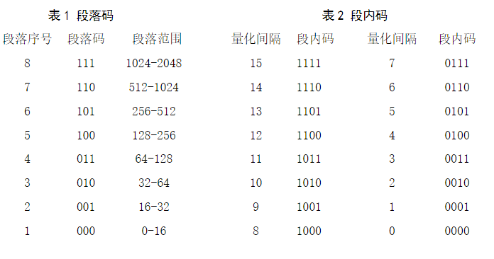

# PCM

## Pulse Code Modulation Matlab implementation

13-segment A-law PCM is a non-linear 8-bit PCM when A (compression parameter) = 87.6. It is used in European and China. The other similar version is u-law, which is used in America and Japan.

The first bit represents the sign of input. 1 is positive and 0 is negative.

Second to fourth bits are segment code. For example, 0 to 16 is the first segment and encodes into 000, while 1024 to 2048 is the eighth segment therefore encodes into 111.

Fifth to Eighth bits are in-segment quantitation code (sorry for not knowing the exact words). Each segment is uniformly divided into 16 intervals.

Decoding is exactly the opposite.

## 脉冲编码调制Matlab实现

PCM 就是对模拟信号先**抽样**，然后对其幅度进行**量化**，再**编码**的过程。

**抽样**，就是对模拟信号进行周期性扫描，把时间上连续的信号变成时间上离散的信号，抽样必须遵循奈奎斯特抽样定理。该模拟信号经过抽样后还应当包含原信号中所有信息，也就是说能无失真的恢复原模拟信号。它的抽样速率的下限是由抽样定理确定的。

**量化**，就是把经过抽样得到的瞬时值将其幅度离散，即用一组规定的电平，把瞬时抽样值用最接近的电平值来表示,通常是用二进制表示。

**量化误差**：量化后的信号和抽样信号的差值。量化误差在接收端表现为噪声，称为量化噪声。量化级数越多误差越小，相应的二进制码位数越多，要求传输速率越高，频带越宽。 为使量化噪声尽可能小而所需码位数又不太多，通常采用**非均匀量化**的方法进行量化。 非均匀量化根据幅度的不同区间来确定量化间隔，幅度小的区间量化间隔取得小，幅度大的区间量化间隔取得大。

**编码**，就是用一组二进制码组来表示每一个有固定电平的量化值。然而，实际上量化是在编码过程中同时完成的，故编码过程也称为模/数变换，可记作A/D。

量化的方法有许多种，比如均匀量化和非均匀量化。

均匀量化，其量阶是常数，根据这种量化进行的编码叫“线性编码”相应的译码叫“线性译码。至于量阶的取值，则需根据具体情况来看，原则是保证通信的质量要求。但是，在电话通信中，均匀量化是不合适的。  因为在均匀量化中的量阶的大小是不变的，与输入的样值大小无关。这样，当输入大信号时和输入小信号时的量化噪声都一样大，如果满足对小信号信扰比的要求则大信号的信扰比就显得太低了。反之，如果满足大信号的要求，则对小信号就显得过剩，造成不必要的浪费。所以必须使用量阶数值比固定，而是随输入值的大小变化。

所以对这样的信号必须使用“非均匀量化器”，其特点是：输入小时，量阶也小；输入大时，量阶也大。这样在整个输入信号的变化范围内得到几乎一样的信扰比，而总的量阶可比均匀量化是还小。因此，缩短了码字的长度，提高了通信效率。非均匀量化就是对信号的不同部分用不同的量化间隔，具体地说，就是对小信号部分采用较小的量化间隔，而对大信号部分就用较大的量化间隔。

非均匀量化的实现方法有两种：一种是北美和日本采用的μ律压扩，一种是欧洲和我国采用的A律压扩。

(以上部分资料来自百度)

本次实现的就是A率13折线非均匀量化，如图：  

编码方式如下，其中用第一位表示量化值的极性，其余七位（第二位至第八位）则表示抽样量化值的绝对大小。第二至第四位表示段落码，它的8种可能状态来分别代表8个段落的起点电平。其它四位表示段内码，它的16种可能状态来分别代表每一段落的16个均匀划分的量化级。这样处理的结果，8个段落被划分成128个量化级。

解码反之。
